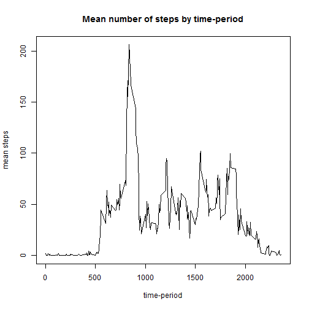
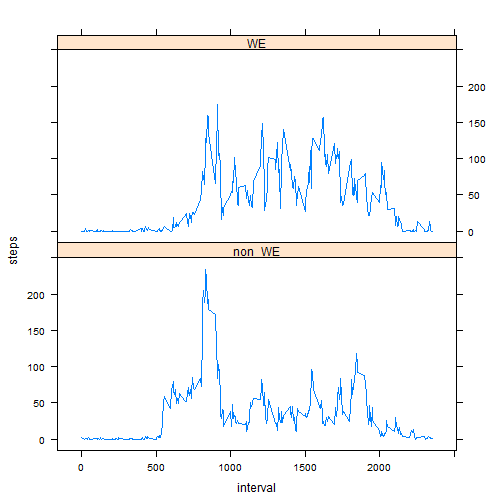

Peer assignment one for the Coursera Data Science specialty's *Reproducible research* course.

##Loading and preprocessing the data

```r
Sys.setlocale("LC_TIME", "English")
```

```
## [1] "English_United States.1252"
```

```r
library(lattice)
```

## Reading datafiles


```r
unzip("activity.zip")
data<-read.csv("activity.csv", colClasses = c("integer","Date","integer"))
```

##What is mean total number of steps taken per day?

### Aggregating data by day
Using aggregate function

```r
stp_per_day<-aggregate(data$steps, by=list(data$date), "sum",na.rm=TRUE, na.action=NULL)
names(stp_per_day)<-c("date","tt_steps")
```


### Producing an histogram
Using barplot


```r
barplot(stp_per_day$tt_steps, names.arg=stp_per_day$date,width = 0.1,main="Total number of steps by day")
```

 


### Calculating mean and median "total steps per day" values
Using common R functions


```r
stp_mean<-mean(stp_per_day$tt_steps)
stp_med<-median(stp_per_day$tt_steps)  
```

The mean number of steps per day is **9354.2295082**.  
The median number of steps per day is **10395**.

##What is the average daily activity pattern?

### Aggregating data by time-period
Using aggregate function

```r
stp_per_tp<-aggregate(data$steps, by=list(data$interval), "mean",na.rm=TRUE, na.action=NULL)
names(stp_per_tp)<-c("interval","mean_steps")
```

### Producing an histogram


```r
plot(stp_per_tp$interval,stp_per_tp$mean_steps, type="l",
     xlab="time-period", ylab="mean steps",main="Mean number of steps by time-period")
```

 

### Max time-period
time-period with max mean steps:


```r
max_mean_step_tp<-
  stp_per_tp[which.max(stp_per_tp$mean_steps),1]

max_mean_step_val<-round(
  stp_per_tp[which.max(stp_per_tp$mean_steps),2],digits=2)
```

The time period with max mean number of steps is interval **835**.  
The max mean steps value is **206.17**.

##Imputing missing values

### Total number of missing values in the dataset


```r
nb_na_rows<-NROW(data[,1])-NROW(na.omit(data[,1]))
```
There are **2304** out of 17568 rows.

###  Filling in all of the missing values
In order to fill missing value we will feed median values for interval in the dataset. In order to do this we'll create a modified datasample names _**datam**_.


```r
datam<-data
for (i in (1:NROW(datam)))
{
  if(is.na(datam[i,1]))
    {datam[i,1]<-
       stp_per_tp[which(stp_per_tp$interval==datam[i,3]),2]}}
```

### Producing an histogram for completed data


```r
stp_per_daym<-aggregate(datam$steps, by=list(datam$date), "sum",na.rm=TRUE, na.action=NULL)
names(stp_per_daym)<-c("date","tt_steps")
barplot(stp_per_daym$tt_steps, names.arg=stp_per_day$date,width = 0.1, main = "Total steps per day, 
 completed sample")
```

 


```r
stp_meanm<-mean(stp_per_daym$tt_steps)
stp_medm<-median(stp_per_daym$tt_steps)  
```

The mean number of steps per day is **1.0766189 &times; 10<sup>4</sup>** for completed sample.  
The median number of steps per day is **1.0766189 &times; 10<sup>4</sup>** for completed sample.  **Both mean and median have slightly increased**.

##Are there differences in activity patterns between weekdays and weekends?

###Defining WE/non-WE days

Creating the WE/non-WE table:

```r
WE_table<-cbind(
  rbind("Monday","Tuesday","Wednesday","Thursday","Friday","Saturday","Sunday"),rbind("non_WE","non_WE","non_WE","non_WE","non_WE","WE","WE"))
colnames(WE_table)<-c("weekday","is_we")
```
Applying to data, displaying result sample:

```r
dataw<-cbind(data,weekday=weekdays(data$date))
dataw<-merge(dataw,WE_table,by="weekday")

##displaying result sample
samdataw<-dataw[which(dataw$interval==0),c(3,1,5)]
samdataw<-samdataw[order(samdataw$date),]
row.names(samdataw) <- NULL 
head(samdataw[order(samdataw$date),],n=10)
```

```
##          date   weekday  is_we
## 1  2012-10-01    Monday non_WE
## 2  2012-10-02   Tuesday non_WE
## 3  2012-10-03 Wednesday non_WE
## 4  2012-10-04  Thursday non_WE
## 5  2012-10-05    Friday non_WE
## 6  2012-10-06  Saturday     WE
## 7  2012-10-07    Sunday     WE
## 8  2012-10-08    Monday non_WE
## 9  2012-10-09   Tuesday non_WE
## 10 2012-10-10 Wednesday non_WE
```

###Comparing WE/non-WE days


```r
stp_interv_we<-aggregate(dataw$steps, by=list(dataw$interval,dataw$is_we), "mean",na.rm=TRUE, na.action=NULL)
colnames(stp_interv_we)<-c("interval","is_we","steps")

xyplot(steps~interval|is_we, data=stp_interv_we, type="l",layout=c(1,2))
```

 

